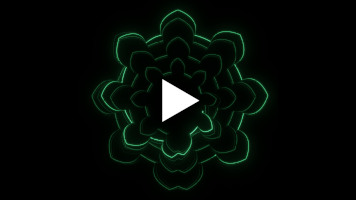

# osc-sim
**osc-sim** is a realistic, CUDA-accelerated CRT oscilloscope software renderer for audio visualization, built on CuPy.

- [Overview](#overview)
- [Demo](#demo)
- [Usage](#usage)
- [Parameters](#parameters)

## Overview
**osc-sim** simulates the phosphor persistence in a traditional cathode ray tube oscilloscope as seen by a camera pointing to the display.

It does so by modelling the light curve of the phosphor display as a bright, instantly-decaying contribution (_fluorescence_) and a dim, slow-decaying exponential contribution (_phosphor persistence_), while accounting for the finite shutter speed of the camera. Optionally, these two contributions can be given different colors (as seen in some radar phosphor displays).

## Demo
[](https://www.youtube.com/watch?v=RuB52WjAXdg)

## Usage
**Requirements:** This Python script requires `ffmpeg`, a CUDA-enabled GPU and a Python installation with the `numpy`, `numba` and `cupy` (https://docs.cupy.dev/en/stable/install.html) packages.

To use **osc-sim**, you need to call it from another Python script:
1. [Download `osc_sim.py`](osc_sim.py) in a folder of your choice
2. Create another python script in the same folder and paste the following
```python
from osc_sim import AnalogOsc

scope = AnalogOsc("audio.wav") # path to your stereo audio file
scope.render("output.mp4")
```
3. Run the second script

This will render your audio file in vectorscope mode with the standard parameters.

### Custom parameters
**Simulation parameters** are passed to the `AnalogOsc` object on initialization. For example:
```python
# pass parameters directly
scope = AnalogOsc("audio.wav", width=1080, height=1080, beam_power=1e7, decay_time=0.02)

# pass parameters with a dictionary
osc_params = {
    'width': 1080,
    'height': 1080,
    'beam_power': 1e7,
    'decay_time': 0.02,
}
scope = AnalogOsc("audio.wav", **osc_params)
```
Parameters pertaining to the **rendering** pipeline (phosphor color for example) are passed directly to the `.render()` method:
```python
scope.render("./output/", save_as_single_frames=True, color="#19ff3f")
```
For a comprehensive list of parameters, see [its dedicated section](#parameters).

## Parameters
**Video and camera**
- `width`, `height`: screen resolution in pixels
- `fps`: frames per second
- `shutter`: shutter, as percentage of a single frame

**Simulation quality**
- `subsampling`: number of signal samples per frame
- `upscaling`: internal integer-upscaling for anti-aliasing
- `glow_downscale_factor`: glow kernel downscaling for performance. Set to `1` to disable

**Electron beam and phosphor display**
- `decay_time`: phosphor characteristic decay time in [s]
- `flash_factor`: intensity of the fast-decaying fluorescence contribution
- `beam_power`: electron beam intensity. Higher means brighter
- `beam_spread`: electron beam spread in pixels
- `glow_radius`: glow halo size in pixels

**Signal processing**
- `scale`: rescales the X-Y signals
- `xy_mode`: True for vectorscope mode, False for oscilloscope mode
- `flip_y`: flips the vertical axis
- `rotate_scope`: rotate the vectorscope by 45°

**Synthetic noise**
- `jitter`: voltage jitter intensity
- `jitter_corr`: auto-correlation time for the voltage jitter in [s]
- `grain`: multiplicative noise intensity
- `background_level`: background light level. Set to `0` to disable

**Grid**
- `grid_opacity`: grid opacity. Set to `0` to disable the grid
- `grid_params`: dictionary with grid parameters. The available parameters are the following
```python
grid_params = {
    'thickness': 2.4,       # thickness of the grid lines
    'subdiv_length': 12,    # length of the subdivision ticks in pixels
    'scale': 0.97,          # global size of the grid
    'divs': 10,             # number of divisions
    'subdivs': 5,           # number of subdivisions per division
}
```

**Render parameters** (Note: should be passed to `.render()` directly. See [usage](#usage))
- `color`: slow-decaying phosphor color, in HEX format
- `flash_color`: fast-decaying fluorescence color. If different from `color`, enables **dual color mode**
- `exposure`: global signal rescaling/gain 
- `gamma`: [gamma correction](https://en.wikipedia.org/wiki/Gamma_correction) power-law exponent
- `output_path`: output video path (or output folder, if `save_as_single_frames` is enabled)
- `save_as_single_frames`: if true, saves the single frames as PNGs
- `start_at_frame`, `end_at_frame`: start/end frames